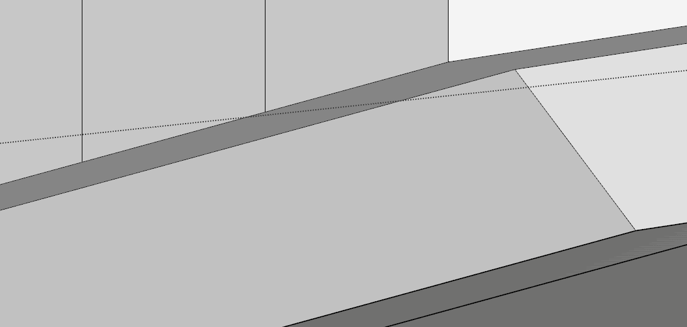
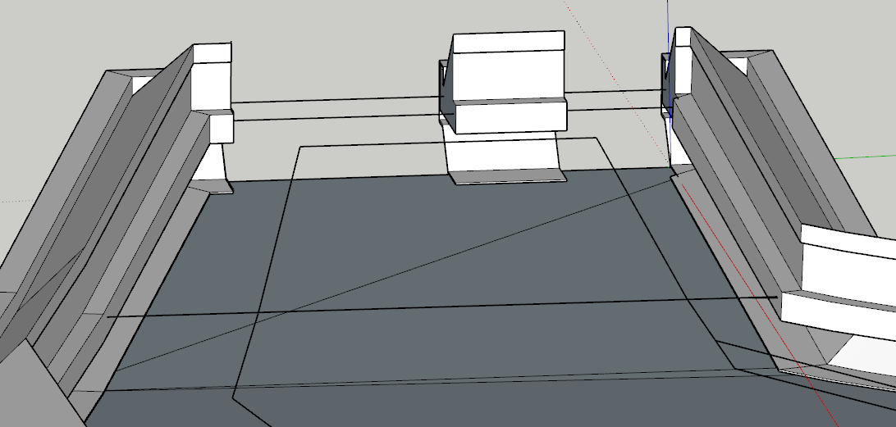

# SketchUp-Tools
SUP gadgets of mine for modeling practicality.

## Basic Explanation / Usage of Commands :

#### J_PROJECTTOLINE    
-Function        : Gets point from user, and project perpendicularly to selected edges. \
-Purpose         : 2D linework on 3D geometry. Such as, drawing precise joint lines on facade tiles smoothly. ↓

#### J_LINEFROMORIGIN   
-Function        : Gets point from user, and draw edge to origin from that point. \
-Purpose         : 2D linework on 3D geometry. Eliminates model view manipulation while drawing edges with distinct start/end points. ↓

